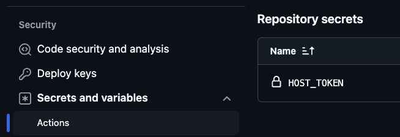

# Docker Host

The **Docker Host** is a service to create and manage [UIX](https://github.com/unyt-org/uix) App containers as portable Docker containers used for UIX app deployment.
Remote containers are created via [DATEX interface](https://docs.unyt.org/manual/datex/public-endpoint-interfaces) on the Docker Host.

## Prerequisites
> [!WARNING]
> **Docker Hosts** are only support on Linux systems. If you experience some issues with your Linux distribution please let us know.

Make sure to have [`git`](https://git-scm.com/book/en/v2/Getting-Started-The-Command-Line), [`Docker`](https://docs.docker.com/get-started/get-docker/) and [`unzip`](https://linux.die.net/man/1/unzip) installed on your machine and available on the system path.

## Setup

You can setup your personal **Docker Host** on the target machine using the following command:
```bash
curl -s https://raw.githubusercontent.com/unyt-org/docker-host/main/setup.sh | bash -s @+YOUR_DOCKER_HOST
```

Make sure to pass a unique [endpoint id](https://docs.unyt.org/manual/datex/endpoints) to the install script. The setup script will create a Docker Host instance by installing [Deno](https://github.com/denoland/deno) and creating a persistent service inside of `etc/systemd/system`.

Make sure that the service is up and running:
```bash
systemctl status unyt_YOUR_DOCKER_HOST
```


## Configuration
The `config.dx` file is used to apply custom configuration to the Docker Host:
```ts
{
	token: "ACCESS_TOKEN",
	enableTraefik: false, 
	hostPort: 80,
	allowArbitraryDomains: true,
	setDNSEntries: false
}
```
* **token** - If an access token is configured, the Docker Host will deploy apps only if they have the correct token configured. It is highly recommended to use a strong access token if the Docker Host is used for personal deployment only.
* **enableTraefik** - If enabled, a [Traefik Proxy](https://traefik.io/traefik/) is installed automatically to act as reverse proxy on your system to handle different domains and automatic SSL. If this option is disabled, you have to make sure to handle the routing of HTTP traffic to your personal container by yourself.
* **hostPort** - Configure the Docker port to expose traefik on.
---
* **allowArbitraryDomains** (*internal*) - Allow arbitrary domains to be configured. If set to false, only [*.unyt.app](https://unyt.app)-domains can be used for deployment.
* **setDNSEntries** (*internal*) - If you have access to the [unyt.org DNS service](https://github.com/unyt-org/dns), you can enable this option to allow for [*.unyt.app](https://unyt.app)-domains.

To reload the configuration, the service must be restarted using the following command:
```bash
systemctl restart unyt_YOUR_DOCKER_HOST
```

## Deploy your UIX app

Your UIX app is automatically deployed to the Docker Host if the `location` option in the `backend/.dx` file is set to the Docker Host endpoint. Please refer to the [Deployment Documentation](https://docs.unyt.org/manual/uix/deployment#example) for more details.

The location can be customized for specific stages:

```ts
use stage from #public.uix;

location: stage {
	staging: 	@+YOUR_STAG_HOST,
	prod: 		@+YOUR_PROD_HOST
}
```

You can configure custom (sub)-domains to be used by your app for different stages:

```ts
domain: stage {
	staging:	"staging.example.com",
	prod:		"example.com"
}
```

You can configure custom endpoints to be used as your app backend endpoints within different stages:

```ts
endpoint: stage {
	staging:	@+example-stage,
	prod:		@+example
}
```

> [!WARNING]
> If the Docker Host you plan to deploy to has a access token configured, you need to pass this access token to UIX to make sure your app can authenticate.<br/>
> You can set the access token as `HOST_TOKEN` environment variable on your local UIX projects console.
> ```bash
> export HOST_TOKEN=YOUR_TOKEN
> ```

To deploy your UIX app, please make sure you have the latest changes in sync with your remote git repository. This is required by the Docker Host, since it will clone your sources via [GitHub](https://github.com) or [GitLab](https://gitlab.com) API on deployment.

To deploy your app, start `uix` via CLI. If you want to select a custom stage pass the `--stage <name>` argument.

```bash
uix --stage prod
```

Above command will select the location configured for the `prod`-stage and deploy your app:
* **Host**: `@+YOUR_PROD_HOST`
* **Domain**: `example.com`
* **Endpoint**: `@+example`

## Automated Git Deployment
> [!WARNING]
> **Git Deployment** is only support for [GitHub](https://github.com) and [GitLab](https://gitlab.com) including [self-hosted option](https://docs.gitlab.com/ee/topics/offline/quick_start_guide.html).


The [git_deploy plugin](https://docs.unyt.org/manual/uix/deployment#github-deployment) can be configured in your `app.dx` file to automate deployment:

```ts
plugin git_deploy (
    // Deploy this app in the 'prod' stage
    // when a push to the main branch occurs
    // The 'MY_SECRET_TOKEN' GitHub secret is passed as an
    // environment variables to the UIX app
    prod: {
        branch: 'main',
        on: 'push',
        secrets: ['MY_SECRET_TOKEN']
    }
)
```

The `git_deploy` plugin takes an object where the keys are the stage names and the values are an object with the following options:

* `branch: (text or text[])` - One or more branches on which the deployment is triggered
* `on: (text or text[])` - GitHub event name that triggers the deployment
* `secrets (text or text[])` - List of GitHub secrets that are exposed to the app as environment variables
* `tests: (boolean)` - If this option is enabled, tests for all `*.test.ts`, `*.test.js` and `*.test.dx` files in the repository are automatically executed before deployment *(enabled per default)*

Make sure to run the `uix` command locally before commiting the changes to the remote repository, since when the `git_deploy` plugin is defined, all GitHub workflow files are generated automatically when the app is run.

> [!WARNING]
> If the Docker Host you plan to deploy to has a access token configured, you need to configure the `HOST_TOKEN` as GitHub/GitLab actions secrets for your repository.<br/>
> 

### Manual deployment via DATEX interface

You can use [DATEX](https://github.com/unyt-org/datex-core-js-legacy) to interact with the `ContainerManager` interface for your Docker Host.

```ts
use ContainerManager from @+YOUR_DOCKER_HOST;

ref container = ContainerManager.createUIXAppContainer(
	"HOST_TOKEN", // Optional access token if configured so
	"git@github.com:benStre/xam.git", // git origin for the UIX app 
	"main", // branch name
	@+my_app_deployment, // endpoint for the deployment stage
	"production", // stage
	["my-app.com"], // custom exposed domains
	["SECRET=123", "SECRET2=42"] // environment variables
);

print container.status // current container status
```

## Create Workbench Container
Workbench container might be helpful for development.
```ts
use ContainerManager from @+YOUR_DOCKER_HOST;

container = ContainerManager.createWorkbenchContainer("HOST_TOKEN");
container.start()
```


---

<sub>&copy; unyt 2024 • [unyt.org](https://unyt.org)</sub>